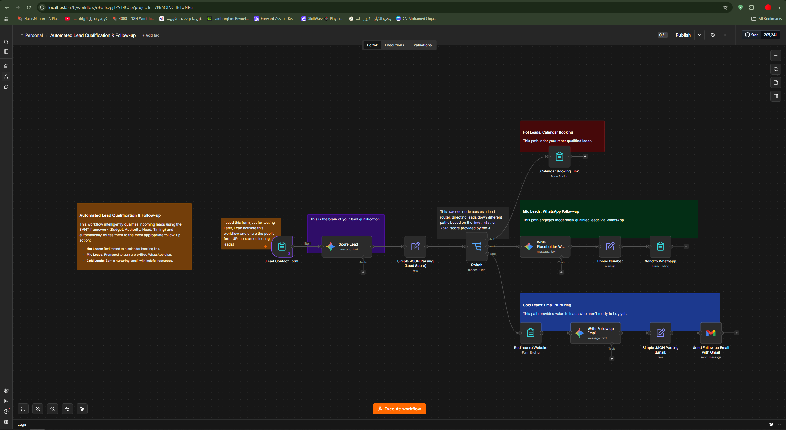

# Automated Lead Qualification & Follow-up Pipeline (n8n Workflow)

An intelligent sales automation and lead routing system built using **n8n**, featuring automated qualification based on the **BANT framework (Budget, Authority, Need, Timing)** and multi-channel personalized follow-ups.

## 🚀 Project Overview
This workflow automates the entire inbound sales pipeline:
1. **Triggers** instantly when a new lead submits information via a **Lead Contact Form**.
2. **Qualifies & Scores** the lead using AI based on the **BANT framework**.
3. **Parses & Routes** the lead dynamically using a **Switch Node** into three distinct tiers:
   * **🔥 Hot Leads:** Automatically routed to a calendar booking link for immediate closing.
   * **⚡ Mid Leads:** Engaged instantly via a pre-filled WhatsApp chat for nurturing.
   * **❄️ Cold Leads:** Enrolled in a targeted email nurturing sequence via **Gmail**.

## ⚙️ Workflow Architecture & Nodes
* **Lead Contact Form:** Inbound webhook trigger capturing user data.
* **Score Lead (AI Model):** Evaluates responses using BANT criteria.
* **Simple JSON Parsing:** Structures the qualification scores.
* **Switch Node:** Directs traffic based on lead temperature.
* **Calendar Booking Link:** High-intent conversion path.
* **WhatsApp Integration:** Medium-intent instant messaging.
* **Email Nurturing & Gmail:** Low-intent long-term relationship building.

## 🛠️ Tech Stack
* **n8n** (Workflow Orchestration & Routing Engine)
* **Google Gemini LLM** (BANT Lead Scoring & Intent Analysis)
* **WhatsApp API** (Instant Follow-ups)
* **Gmail API** (Automated Email Nurturing)
* **Webhooks**

## 📸 Workflow Preview

